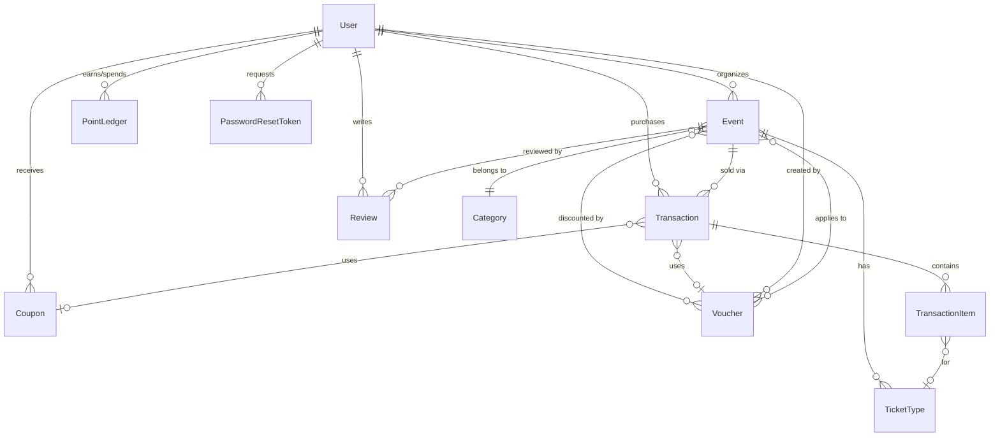

# Database Schema

## 1. Entity Relationship Diagram



## 2. Full Prisma Schema

```prisma
// apps/api/prisma/schema.prisma

generator client {
  provider = "prisma-client-js"
}

datasource db {
  provider = "postgresql"
  url      = env("DATABASE_URL")
}

// ─────────────────────────────────────────────
// ENUMS
// ─────────────────────────────────────────────

enum Role {
  CUSTOMER
  ORGANIZER
}

enum EventStatus {
  DRAFT
  PUBLISHED
  COMPLETED
  CANCELED
}

enum TransactionStatus {
  WAITING_FOR_PAYMENT
  WAITING_FOR_ADMIN_CONFIRMATION
  DONE
  REJECTED
  EXPIRED
  CANCELED
}

enum DiscountType {
  PERCENTAGE
  FIXED
}

enum PointType {
  CREDIT
  DEBIT
}

// ─────────────────────────────────────────────
// MODELS
// ─────────────────────────────────────────────

model User {
  id              String    @id @default(uuid())
  email           String    @unique
  password        String
  firstName       String
  lastName        String
  role            Role
  referralCode    String    @unique
  profilePicture  String?
  createdAt       DateTime  @default(now())
  updatedAt       DateTime  @updatedAt
  deletedAt       DateTime?

  // Relations
  events          Event[]           @relation("OrganizerEvents")
  transactions    Transaction[]
  reviews         Review[]
  pointLedger     PointLedger[]
  coupons         Coupon[]
  vouchers        Voucher[]         @relation("OrganizerVouchers")
  passwordResets  PasswordResetToken[]

  @@index([email])
  @@index([referralCode])
  @@index([role])
}

model Category {
  id        String   @id @default(uuid())
  name      String   @unique
  slug      String   @unique
  createdAt DateTime @default(now())

  // Relations
  events    Event[]
}

model Event {
  id             String      @id @default(uuid())
  name           String
  slug           String      @unique
  description    String
  location       String
  startDate      DateTime
  endDate        DateTime
  totalSeats     Int
  availableSeats Int
  isFree         Boolean     @default(false)
  price          Decimal?    @db.Decimal(12, 2)
  bannerUrl      String?
  status         EventStatus @default(PUBLISHED)
  createdAt      DateTime    @default(now())
  updatedAt      DateTime    @updatedAt
  deletedAt      DateTime?

  // Foreign keys
  organizerId    String
  categoryId     String

  // Relations
  organizer      User          @relation("OrganizerEvents", fields: [organizerId], references: [id])
  category       Category      @relation(fields: [categoryId], references: [id])
  ticketTypes    TicketType[]
  transactions   Transaction[]
  reviews        Review[]
  voucherEvents  VoucherEvent[]

  @@index([organizerId])
  @@index([categoryId])
  @@index([slug])
  @@index([startDate])
  @@index([status])
}

model TicketType {
  id             String    @id @default(uuid())
  name           String
  price          Decimal   @db.Decimal(12, 2)
  quota          Int
  availableQuota Int
  createdAt      DateTime  @default(now())
  updatedAt      DateTime  @updatedAt
  deletedAt      DateTime?

  // Foreign keys
  eventId        String

  // Relations
  event          Event              @relation(fields: [eventId], references: [id])
  transactionItems TransactionItem[]

  @@index([eventId])
}

model Transaction {
  id                    String            @id @default(uuid())
  totalPrice            Decimal           @db.Decimal(12, 2)
  discountAmount        Decimal           @default(0) @db.Decimal(12, 2)
  pointsUsed            Int               @default(0)
  finalPrice            Decimal           @db.Decimal(12, 2)
  status                TransactionStatus @default(WAITING_FOR_PAYMENT)
  paymentProofUrl       String?
  bookingCode           String?           @unique
  isAttended            Boolean           @default(false)
  paymentDeadline       DateTime
  confirmationDeadline  DateTime?
  createdAt             DateTime          @default(now())
  updatedAt             DateTime          @updatedAt
  deletedAt             DateTime?

  // Foreign keys
  userId                String
  eventId               String
  voucherId             String?
  couponId              String?

  // Relations
  user                  User              @relation(fields: [userId], references: [id])
  event                 Event             @relation(fields: [eventId], references: [id])
  voucher               Voucher?          @relation(fields: [voucherId], references: [id])
  coupon                Coupon?           @relation(fields: [couponId], references: [id])
  items                 TransactionItem[]

  @@index([userId])
  @@index([eventId])
  @@index([status])
  @@index([bookingCode])
  @@index([paymentDeadline])
}

model TransactionItem {
  id           String   @id @default(uuid())
  quantity     Int
  pricePerUnit Decimal  @db.Decimal(12, 2)
  subtotal     Decimal  @db.Decimal(12, 2)

  // Foreign keys
  transactionId String
  ticketTypeId  String?

  // Relations
  transaction   Transaction @relation(fields: [transactionId], references: [id])
  ticketType    TicketType? @relation(fields: [ticketTypeId], references: [id])

  @@index([transactionId])
}

model Voucher {
  id              String       @id @default(uuid())
  code            String       @unique
  discountType    DiscountType
  discountAmount  Decimal      @db.Decimal(12, 2)
  maxUsage        Int
  usageCount      Int          @default(0)
  validFrom       DateTime
  validUntil      DateTime
  createdAt       DateTime     @default(now())
  updatedAt       DateTime     @updatedAt
  deletedAt       DateTime?

  // Foreign keys
  organizerId     String

  // Relations
  organizer       User           @relation("OrganizerVouchers", fields: [organizerId], references: [id])
  voucherEvents   VoucherEvent[]
  transactions    Transaction[]

  @@index([code])
  @@index([organizerId])
  @@index([validFrom, validUntil])
}

model VoucherEvent {
  id        String @id @default(uuid())

  // Foreign keys
  voucherId String
  eventId   String

  // Relations
  voucher   Voucher @relation(fields: [voucherId], references: [id])
  event     Event   @relation(fields: [eventId], references: [id])

  @@unique([voucherId, eventId])
  @@index([voucherId])
  @@index([eventId])
}

model Coupon {
  id              String    @id @default(uuid())
  code            String    @unique
  discountPercent Decimal   @db.Decimal(5, 2) // Always 10.00
  isUsed          Boolean   @default(false)
  expiresAt       DateTime
  createdAt       DateTime  @default(now())

  // Foreign keys
  userId          String

  // Relations
  user            User          @relation(fields: [userId], references: [id])
  transactions    Transaction[]

  @@index([userId])
  @@index([code])
}

model PointLedger {
  id          String    @id @default(uuid())
  amount      Int
  type        PointType
  description String
  expiresAt   DateTime?
  createdAt   DateTime  @default(now())

  // Foreign keys
  userId      String

  // Relations
  user        User @relation(fields: [userId], references: [id])

  @@index([userId])
  @@index([expiresAt])
  @@index([type])
}

model Review {
  id        String    @id @default(uuid())
  rating    Int       // 1-5
  comment   String?
  createdAt DateTime  @default(now())
  updatedAt DateTime  @updatedAt
  deletedAt DateTime?

  // Foreign keys
  userId    String
  eventId   String

  // Relations
  user      User  @relation(fields: [userId], references: [id])
  event     Event @relation(fields: [eventId], references: [id])

  @@unique([userId, eventId]) // One review per customer per event
  @@index([eventId])
  @@index([userId])
}

model PasswordResetToken {
  id        String   @id @default(uuid())
  tokenHash String   @unique
  expiresAt DateTime
  createdAt DateTime @default(now())

  // Foreign keys
  userId    String

  // Relations
  user      User @relation(fields: [userId], references: [id])

  @@index([userId])
  @@index([tokenHash])
}
```

## 3. Relationship Summary

| Relationship | Type | Constraint |
|---|---|---|
| User → Event | One-to-many | An Organizer creates many events |
| User → Transaction | One-to-many | A Customer has many transactions |
| User → Review | One-to-many | A Customer writes many reviews |
| User → PointLedger | One-to-many | A Customer has many point entries |
| User → Coupon | One-to-many | A Customer receives coupons |
| User → Voucher | One-to-many | An Organizer creates many vouchers |
| Category → Event | One-to-many | A Category contains many events |
| Event → TicketType | One-to-many | An Event has many ticket types |
| Event → Transaction | One-to-many | An Event has many transactions |
| Event → Review | One-to-many | An Event has many reviews |
| **Voucher ↔ Event** | **Many-to-many** | **Via VoucherEvent junction table** |
| Transaction → TransactionItem | One-to-many | A Transaction has many items |
| TransactionItem → TicketType | Many-to-one (optional) | An item may reference a ticket type |
| Transaction → Voucher | Many-to-one (optional) | A Transaction may use a voucher |
| Transaction → Coupon | Many-to-one (optional) | A Transaction may use a coupon |
| Review: userId + eventId | **Unique constraint** | One review per customer per event |

## 4. Index Strategy

All indexes are defined in the schema above. Key decisions:
- **Foreign keys**: Always indexed for JOIN performance
- **Unique fields**: `email`, `referralCode`, `slug`, `bookingCode`, `voucher.code`, `coupon.code` — all indexed via `@unique`
- **Query patterns**: `Event.startDate` (sorting), `Event.status` (filtering), `Transaction.status` (filtering), `Transaction.paymentDeadline` (expiry checks), `PointLedger.expiresAt` (balance calculation)

## 5. Soft Delete Middleware

Prisma middleware to auto-filter soft-deleted records on all queries:

```ts
// apps/api/src/config/database.ts

import { PrismaClient } from "@prisma/client";

const prisma = new PrismaClient();

// Soft delete middleware: automatically filter deletedAt IS NULL on find operations
prisma.$use(async (params, next) => {
  const softDeleteModels = ["User", "Event", "Transaction", "Review", "TicketType", "Voucher"];

  if (softDeleteModels.includes(params.model ?? "")) {
    if (params.action === "findMany" || params.action === "findFirst") {
      params.args = params.args || {};
      params.args.where = params.args.where || {};
      if (params.args.where.deletedAt === undefined) {
        params.args.where.deletedAt = null;
      }
    }
  }

  return next(params);
});

export default prisma;
```

## 6. Seed Data Specification

```ts
// apps/api/prisma/seed.ts

// Categories (8 — pre-seeded, never modified)
const categories = [
  "Music", "Technology", "Sports", "Arts & Culture",
  "Food & Drink", "Business", "Education", "Entertainment"
];

// Users
// 3 Organizers:
//   organizer1@example.com / Password123! (Organizer A — has most events)
//   organizer2@example.com / Password123! (Organizer B)
//   organizer3@example.com / Password123! (Organizer C)
// 5 Customers:
//   customer1@example.com / Password123! (Customer A — has many transactions)
//   customer2@example.com / Password123! (Customer B — registered via referral)
//   customer3@example.com / Password123! (Customer C)
//   customer4@example.com / Password123! (Customer D)
//   customer5@example.com / Password123! (Customer E)
// Each user gets a unique referralCode (REF-XXXXXX)

// Events (30+ total, distributed across organizers and categories)
// Mix of:
//   - Free events (at least 5)
//   - Paid events without ticket types (at least 10)
//   - Paid events with ticket types (at least 10)
//   - Past events (endDate < now) — at least 8 (for review testing)
//   - Upcoming events (startDate > now) — at least 15
//   - Ongoing events (startDate < now < endDate) — at least 3
//   - One canceled event
// Prices range from IDR 50,000 to IDR 2,000,000
// Locations: "Jakarta", "Bandung", "Surabaya", "Yogyakarta", "Bali"
// Banner images: use Cloudinary placeholder images

// Ticket Types (for events with ticket types)
// Examples:
//   - "Regular" IDR 100,000 (200 seats), "VIP" IDR 500,000 (50 seats)
//   - "Early Bird" IDR 75,000 (100 seats), "Regular" IDR 150,000 (300 seats), "Premium" IDR 400,000 (50 seats)

// Transactions (30+ total)
// Mix of all 6 statuses:
//   - WAITING_FOR_PAYMENT: 3 (with future paymentDeadline)
//   - WAITING_FOR_ADMIN_CONFIRMATION: 4 (with payment proof URL)
//   - DONE: 15 (with bookingCode, some isAttended=true)
//   - REJECTED: 3
//   - EXPIRED: 3
//   - CANCELED: 2
// Some use vouchers, some use coupons, some use points

// Vouchers (5+)
// Created by organizers, linked to their events via VoucherEvent
// Mix of PERCENTAGE and FIXED discount types
// Some expired, some currently valid, some with maxUsage reached

// Coupons (3+)
// Linked to customers who registered via referral
// Some used, some unused, some expired

// PointLedger entries (30+)
// CREDIT entries for referral rewards (+10,000 each)
// DEBIT entries for point usage in transactions
// Some credits with expired expiresAt (for testing)

// Reviews (10+)
// Only for past events where transaction status is DONE and isAttended=true
// Ratings distributed 1-5, with comments

// PasswordResetToken — empty (created on-demand)
```

## 7. Price Calculation Formula

```
Given:
  ticketPrice = sum of (item.quantity × item.pricePerUnit) for all TransactionItems
  voucher = optional Voucher
  coupon = optional Coupon (mutually exclusive with voucher)
  pointsToUse = integer, from PointLedger available balance

Step 1 — Apply voucher OR coupon (not both):
  if (voucher):
    if (voucher.discountType === "PERCENTAGE"):
      discount = ticketPrice × voucher.discountAmount / 100
    else:
      discount = voucher.discountAmount
  else if (coupon):
    discount = ticketPrice × coupon.discountPercent / 100
  else:
    discount = 0

Step 2 — Apply points:
  pointsDiscount = min(pointsToUse, ticketPrice - discount)
  // Points cannot make the price negative

Step 3 — Final price:
  finalPrice = max(0, ticketPrice - discount - pointsDiscount)

Store in Transaction:
  totalPrice = ticketPrice (before any discounts)
  discountAmount = discount (from voucher or coupon)
  pointsUsed = pointsDiscount
  finalPrice = finalPrice
```

## 8. Test Database Isolation & Fixture Factory Specification

To ensure deterministic, isolated execution across all integration test suites without test cross-talk or race conditions (as locked in ADR 0002), the following test database architecture is enforced:

### 8.1 Truncate-and-Reseed Helper (`truncateAll`)
**File:** `apps/api/__tests__/setup/helpers.ts`
Instead of rolling back transactions or recreating schemas per test, every test suite invokes `truncateAll()` in `beforeEach()`. This executes a raw SQL command wiping data while preserving table structures and indexes:

```ts
import prisma from "../../src/config/database";

export async function truncateAll(): Promise<void> {
  const tablenames = await prisma.$queryRaw<
    Array<{ tablename: string }>
  >`SELECT tablename FROM pg_tables WHERE schemaname='public' AND tablename NOT IN ('_prisma_migrations');`;

  const tables = tablenames
    .map(({ tablename }) => `"public"."${tablename}"`)
    .join(", ");

  if (tables.length > 0) {
    await prisma.$executeRawUnsafe(`TRUNCATE TABLE ${tables} CASCADE;`);
  }
}
```

### 8.2 Minimal Fixture Factories
To avoid depending on static seed scripts during TDD test runs, integration tests use factory functions to create minimal, isolated database prerequisites:

```ts
// Example factory usage in __tests__/integration/auth/register.test.ts
export async function createTestUser(overrides: Partial<User> = {}) {
  return prisma.user.create({
    data: {
      email: `test-${Date.now()}@example.com`,
      passwordHash: "$2b$10$hashedpasswordstring...",
      firstName: "Test",
      lastName: "User",
      role: "CUSTOMER",
      referralCode: `REF-${Math.random().toString(36).substring(2, 8).toUpperCase()}`,
      ...overrides,
    },
  });
}
```

